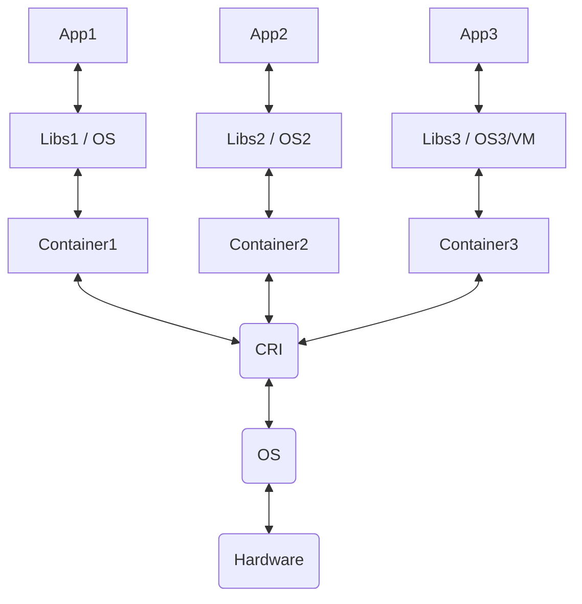

# Start

## What is K8s

Simply - container orchestrator (declarative configuration + automation)

### Containers

[K8s Overwiev](https://kubernetes.io/docs/concepts/overview/)




- Containers are similar to VMs, but they share OS properties (kernel) among the applications.
- Containers provides isolation of user space
- Containers are portable. Bundled libraries and apps are build into container

### CRI (Container Runtime Interface)

[About CRI](https://www.aquasec.com/cloud-native-academy/container-security/container-runtime-interface/)
The container engine (often referred to as operating-system-level virtualization) is based on an operating system in which the kernel allows multiple isolated instances. Each instance is called a container, virtualization engine, or “jail”.

Container runtime interface (CRI) is a plugin interface that lets the kubelet an agent that runs on every node in a Kubernetes cluster use more than one type of container runtime. Container runtimes are a foundational component of a modern containerized architecture.

### Why K8s need CRI

- kubelet - the kubelet is a daemon that runs on every Kubernetes node. It implements the pod and node APIs that drive most of the activity within Kubernetes.
- Pods - a pod is the smallest unit of reference within Kubernetes. Each pod runs one or more containers, which together form a single functional unit.
- Pod specs - the kubelet read pod specs, usually defined in YAML configuration files. The pod specs say which container images the pod should run. It provides no details as to how containers should run - for this, Kubernetes needs a container runtime.
- Container runtime - a Kubernetes node must have a container runtime installed. When the kubelet wants to process pod specs, it needs a container runtime to create the actual containers. The runtime is then responsible for managing the container lifecycle and communicating with the operating system kernel.

### Runc and OCI

[Open Container Initiative](https://opencontainers.org/about/overview/)
[Runc](https://github.com/opencontainers/runc)

- runc is a CLI tool for spawning and running containers on Linux according to the OCI specification - a seed container runtime engine. The majority of modern container runtime environments use runc and develop additional functionality around this seed engine.
- OCI image specification-OCI adopted the original Docker image format as the basis for the OCI image specification. The majority of open source build tools support this format, including BuildKit, Podman, and Buildah. Container runtimes that implement the OCI runtime specification can unbundle OCI images and run its content as a container.

## How does K8s Realy work


### K8s object

- Pod - Pods are the smallest deployable units of computing that you can create and manage in Kubernetes. A Pod (as in a pod of whales or pea pod) is a group of one or more containers, with shared storage and network resources, and a specification for how to run the containers.
- Service - In Kubernetes, a Service is a method for exposing a network application that is running as one or more Pods in your cluster.
- ReplicaSet - A ReplicaSet's purpose is to maintain a stable set of replica Pods running at any given time. As such, it is often used to guarantee the availability of a specified number of identical Pods.
- DaemonSet - A DaemonSet ensures that all (or some) Nodes run a copy of a Pod. As nodes are added to the cluster, Pods are added to them. As nodes are removed from the cluster, those Pods are garbage collected. Deleting a DaemonSet will clean up the Pods it created.
- Deployment - Describes the desired state and makes sure to change the actual state to the desired state if needed. A deployment manages Pods and ReplicaSets so you don’t have to.

## Live demo?

[Play with k8s](https://labs.play-with-k8s.com/)

1. Initializes cluster master node:

```
kubeadm init --apiserver-advertise-address $(hostname -i) --pod-network-cidr 10.5.0.0/16
```

2. Initialize cluster networking:

```
kubectl apply -f https://raw.githubusercontent.com/cloudnativelabs/kube-router/master/daemonset/kubeadm-kuberouter.yaml
```

3.0. Verify

```
kubectl get --raw='/readyz?verbose'
```

3. K8s hello world

https://kubernetes.io/docs/tutorials/hello-minikube/

```
# Run a test container image that includes a webserver
kubectl create deployment hello-node --image=registry.k8s.io/e2e-test-images/agnhost:2.39 -- /agnhost netexec --http-port=8080
```

```
kubectl get deployments
```

```
kubectl get pods
```

```
kubectl taint nodes node1 node-role.kubernetes.io/master-
kubectl taint nodes node1 node.kubernetes.io/disk-pressure-
```

```
kubectl get events
```

```
kubectl config view
```

Exposing pod by creating service

```
kubectl expose deployment hello-node --type=LoadBalancer --port=8080
```

```
kubectl get services
```
